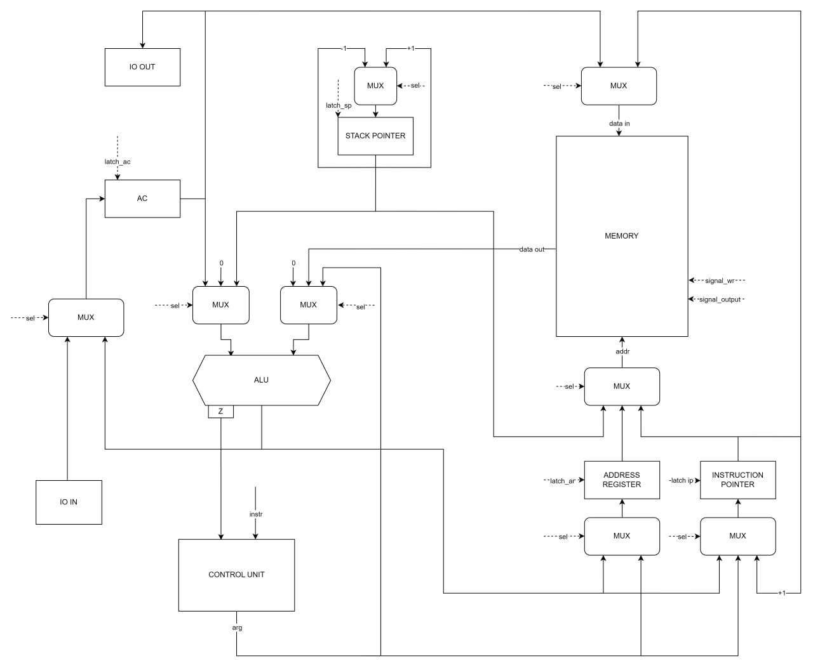
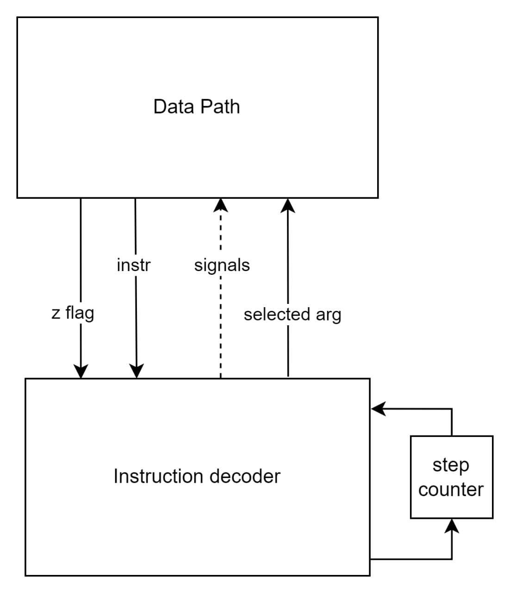

# Отчёт по лабораторной работе № 3

Канукова Ева Алановна, P33302

Вариант
```lisp | acc | neum | hw | instr | binary | stream | port | cstr | prob1 | [4]char```

Без усложнения

## Язык программирования

Lisp

```bnf
program ::= list

list ::= "(" identefier { atom | list } ")"

atom ::= identifier | string_literal | number_literal | bool_literal

identifier ::= letter { letter | digit | separating_symbol } | symbol
string_literal ::= "'" any symbol except ' "'"
number_literal ::= any digit combination without "0" in the beggining or just "0"
bool_literal ::= "T" | "F"

letter ::= "a" | "b" | " ..." | "Z" 
digit ::= "0" | "1" | " ..." | "9" 
separating_symbol ::= "_"
symbol ::= "+" | "-" | "%" | "=" | "!="
```
### Ключевые слова
1. Условный оператор - (`if cond if_true if_false`)

2. Цикл с предусловием - (`while cond action1 action2...`)

3. Определение функции - (`fun name (arg1 arg2...) action1 action2...`)
Должно идти до кода, вызывающего функцию.

4. Присваивание - (`set var_name var_value`)

5. Выделение памяти под строковый массив - (`alloc name len`) 

6. Запись символа в строковый массив - (`set_char string_name pos char`)

7. Чтение символа из потока ввода - (`read_сhar`)

8. Вывод символа - (`print_сhar char`)

9. Вывод строки - (`print_string string`)

10. Вывод числа - (`print_int int`)

11. Арифметика - `+, -, \, %`

12. Сравнение - `=, !=`

13. Логическое И - `&`

* Вызов функции возвращает последнее выражение в теле функции
* Имя переменной возвращает ее последнее присвоенное значение
* Имя строкового массива возвращает адрес его начала
* Целочисленный литерал возвращает себя
* Логический литерал возвращает 1 (T) или 0 (F)
* Строковый литерал возвращает адрес начала строки в статической памяти


**Видимость** переменных вне функции - глобальная. 
Аргументы функции и переменные, объявленные внутри нее - локальны.

**Типизация:** переменные имеют только целочисленный тип (при использовании функций с char в названии число интерпретируется как код ASCII), для хранения строк используется строковый массив

**Литералы:** целочисленные, строковые, логические

## Организация памяти 

Фон Неймановская архитектура.

Размер машинного слова: 32 бита

Память представляет из себя четыре секции:

```text
    +-----------------+
    |   JMP_TO_CODE   |
    +-----------------+
    |   STATIC_DATA   |
    |                 |
    |                 |
    |                 |
    +-----------------+
    |      CODE       |
    |                 |
    |                 |
    |                 |
    +-----------------+
    |      STACK      |
    |                 |
    |                 |
    +-----------------+
```

* Функции хранятся в секции `CODE` в виде списка инструкций, которые выполняются последовательно. 
Перед телом функции идет инструкция JMP, которая позоляет перепрыгнуть через ее тело.


* Переменные объявленные вне определения функции кладутся в статическую память,
иначе на стек


* Строковые литералы - в статическую память


* Числовые литералы загружаются с помощью прямой загрузки операнда (в команде).
Если не влезают в 24 бита - располагаются в статической памяти


* Логические литералы - прямая загрузка 0 или 1

Все литералы в статической памяти располагаются в порядке их встречи в коде

Так как архитектура аккумуляторная, в аккумуляторе хранится результат последнего выражения, отображения переменных на регистры не происходит.

## Система команд

* Машинное слово - 32 бита, беззнаковое.
* Так как архитектура аккумуляторная команды имеют максимум 1 аргумент.
* Поток управления:
  * Условный переход (JZ) 
  * Безусловный переход (JMP)
  * Инкремент IP (Instruction Pointer)

Виды адресации:
* Прямая - `addr` - для всех адресных команд
* Косвенная - `()` - для `LOAD`, `SAVE`
* Загрузка операнда - `#` - для `ADD`, `SUB`, `DIV`, `MOD`, `CMP`, `LOAD`
* Относительно SP - `&`- для всех адресных команд


### Набор инструкций

| Инструкция | адр/безадр | Количество тактов | Описание                               |
|------------|------------|-------------------|----------------------------------------|
| `ADD`      |            | 2 - 5             | AC, Z <- AC + arg                      |
| `SUB`      |            | 2 - 5             | AC, Z <- AC - arg                      |
| `DIV`      |            | 2 - 5             | AC, Z <- AC / arg                      |
| `MOD`      |            | 2 - 5             | AC, Z <- AC % arg                      |
| `LOAD`     |            | 2 - 5             | AC, Z <- arg                           |
| `SAVE`     |            | 2 - 4             | MEM(ADDR) <- AC                        |
| `PRINT`    | безадр     | 1                 | OUT <- AC                              |
| `INPUT`    | безадр     | 1                 | AC <- IN                               |
| `CMP`      |            | 2 - 5             | Z <- AC - arg                          |
| `JZ`       |            | 1                 | if Z == 0 then IP <- arg               |
| `JMP`      |            | 1                 | IP <- arg                              |
| `CALL`     |            | 2                 | SP <- SP - 1; MEM(SP) <- IP; IP <- arg |
| `RETURN`   | безадр     | 2                 | IP <- MEM(SP); SP <- SP + 1            |
| `PUSH`     | безадр     | 2                 | SP <- SP - 1; MEM(SP) <- AC            |
| `POP`      | безадр     | 1                 | SP <- SP + 1                           | 
| `HLT`      | безадр     | 1                 | останов                                |

## Транслятор
Транслятор состоит из двух частей:
* Разделение исходного текста на термы реализовано в [lexer](./src/translator/lexer.py)
* Модуль, преобразующий термы в программу, реализован в [translator](./src/translator/translator.py)

На вход принимает три имени файла:
* Файл с программой для трансляции
* Путь к файлу для отладочного вывода
* Путь к бинарному файлу 

## Модель процессора

### DataPath



Элементы:
* `Z` - Флаг zero
* `IP` - Instruction Pointer
* `AR` - Address Register
* `SP` - Stack Pointer
* `AC` - Accumulator
* `ALU` - Arithmetic Logic Unit

### ControlUnit



Golden тесты:
* [hello](./golden/hello.yml)
* [cat](./golden/cat.yml)
* [hello-name](./golden/hello-name.yml)
* [prob1](./golden/prob1.yml)


## Аналитика

```text
| Канукова Ева Алановна  | hello | 1         | -             | 25            | 89       | 191     | lisp | acc | neum | hw | instr | binary | stream | port | cstr | prob1 | [4]char`|
| Канукова Ева Алановна  | cat   | 4         | -             | 17            | 41       | 67      | lisp | acc | neum | hw | instr | binary | stream | port | cstr | prob1 | [4]char`|
| Канукова Ева Алановна  | prob1 | 15        | -             | 82            | 262      | 552     | lisp | acc | neum | hw | instr | binary | stream | port | cstr | prob1 | [4]char`|
```